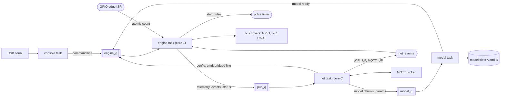
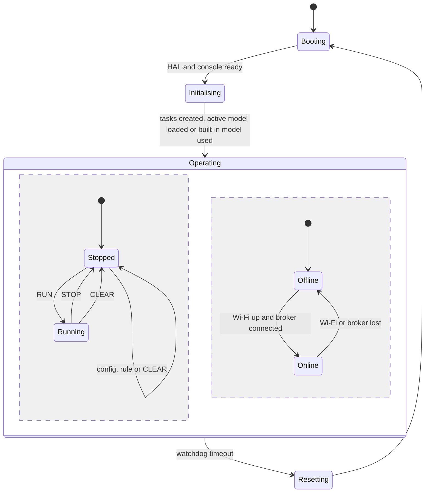
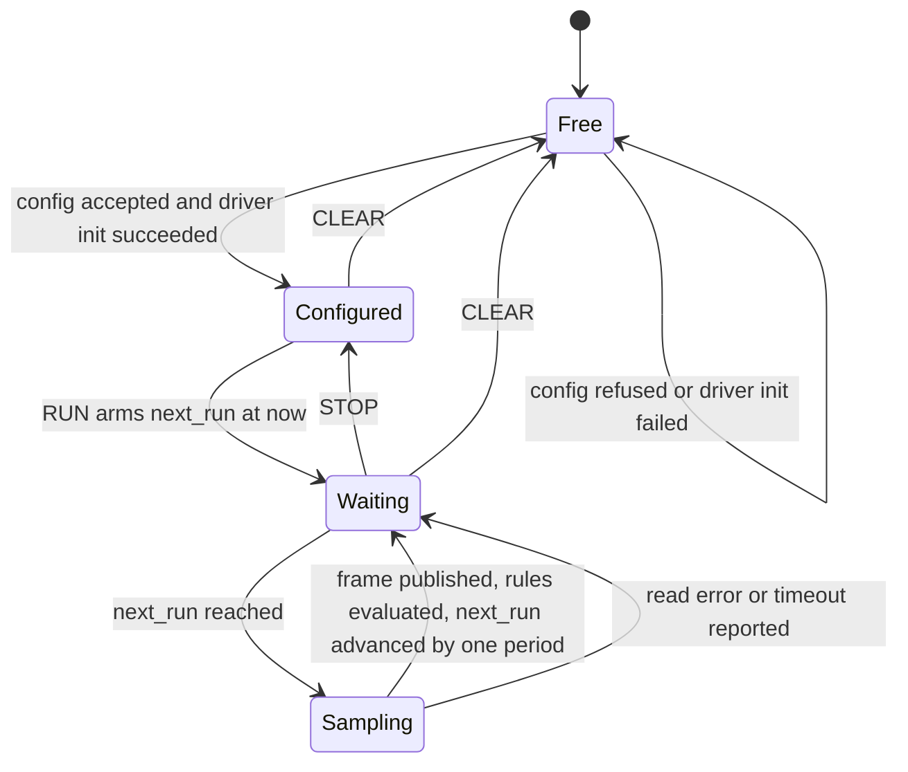
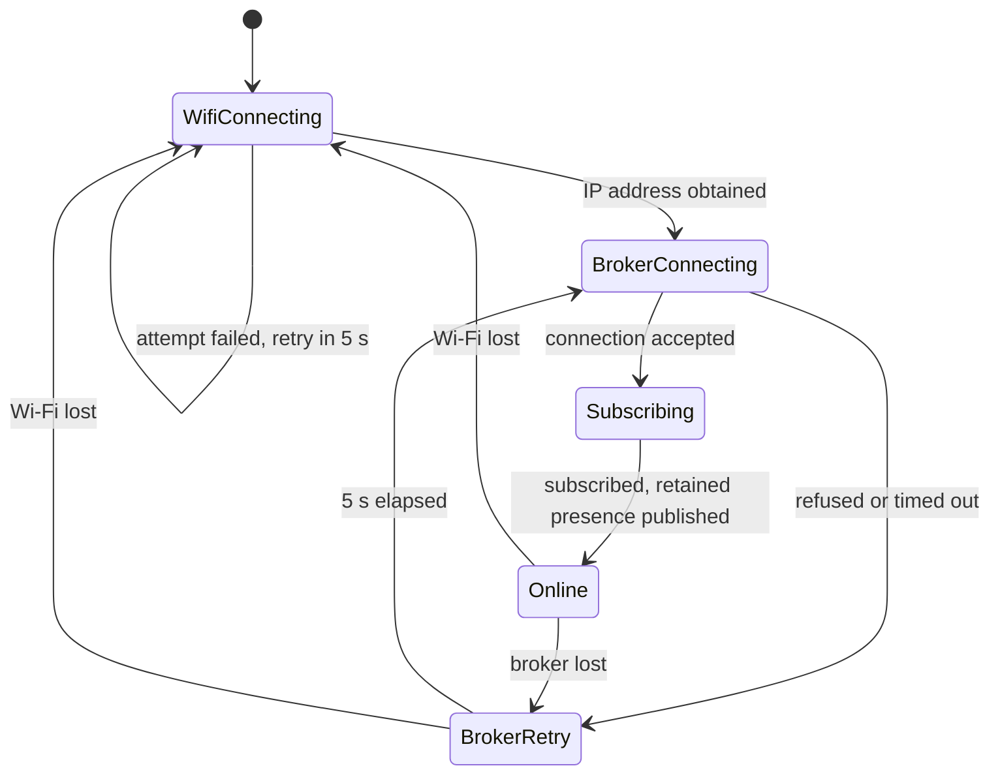
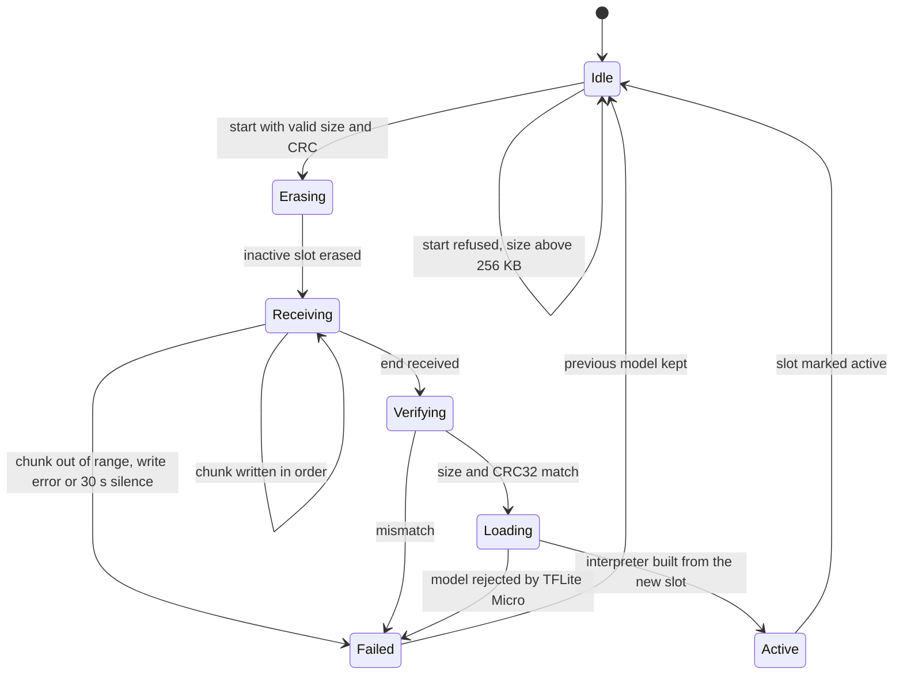

# D1 Architecture Freeze (Task 10)

Status: draft for team review, 2026-10-03, prepared by Hasif. The README makes this task the gate before tasks 11 to 23, so it closes only when tasks 7 to 9 are finished, section 5 holds the confirmed pin layout, and the team has reviewed every section (recorded in section 15).

Requirements, the parity table and every test ID cited here are defined in [parity/PARITY.md](parity/PARITY.md). The Pico reference is the tag `pico-reference`.

## 1. Team roles and subsystem ownership

The port keeps the reference's application logic and replaces only what touches the platform. The table divides the code that way and maps each part to its implementation task. Owners for tasks 11 to 23 are assigned at the review; the D1 team is Hasif, Cody and Sitt.

| Subsystem | Shared code (logic kept) | Platform code (rewritten for the S3) | Tasks | Owner |
|---|---|---|---|---|
| HAL | None | Pico HAL and ESP32-S3 HAL (section 4) | 11, 12 | |
| Runtime and REPL | `repl.c` line handling | FreeRTOS tasks, queues, watchdog (sections 6, 7) | 13 | |
| Scheduler and GPIO modes | `scheduler.c`, `config_parser.c` | GPIO driver behind `bus_gpio` | 14, 15 | |
| I2C | None | I2C driver behind `bus_i2c`, on `Wire` | 16 | |
| UART | None | UART driver behind `bus_uart`, on `HardwareSerial` | 17 | |
| Rule engine | `rules.c`, `rule_expr.c`, `rule_action.c` | GPIO and PWM actions through the HAL | 18 | |
| Wi-Fi, MQTT, bridging | `mqtt_config_parser.c`, `mqtt_json_parser.c`, `sensor_bridge.c` | Network driver in the `net` task | 19 | |
| Model transfer, inference | `inference_manager.c`, transfer state machine | Model store, TFLite Micro wrapper | 20 | |
| Verification | `parity_test.py`, `mqtt_test.py` | S3 pin map for the harness | 21 | |
| Pico requirements and baseline | | | 4 to 6 | Hasif (done) |
| S3 environment and bring-up | | | 7 to 9 | Sitt |

## 2. Final requirements

The requirements are FR-01 to FR-15 and NFR-01 to NFR-06 as signed off in PARITY.md §1. This review proposes three additions, which are written into PARITY.md once accepted. NFR-07 covers reconnection: after a Wi-Fi or broker loss the node retries at least every 5 s and is back online within 10 s of the network returning, verified by T-11 (the Pico reconnected 3 s after the broker restarted). The T-05 limit is proposed at 1 kHz: counter mode must lose no edges from a 1 kHz square wave produced by an LEDC output looped to the counter input. The third addition is the defect dispositions in section 3.

## 3. Reference defect dispositions

Reproducing the reference bugs for strict parity would build known faults into the new port, so the proposal is to fix all twelve. Each fix is an intended deviation: the S3 column of the named parity row records the corrected behaviour and cites the defect.

| Defect | Proposed disposition | Expected S3 result | Row |
|---|---|---|---|
| D-01 unknown `proto=` becomes I2C | Fix: refuse the block with an error | Refused | N-01 |
| D-02 missing `gpio.pin` reads GP2 | Fix: refuse the block | Refused | N-03 |
| D-03 malformed `when=` accepted | Fix: compile the expression when the rule is added | Refused when added | N-07 |
| D-04 bad action pin found only when fired | Fix: validate action pins when the rule is added | Refused when added | N-05 |
| D-05 UART receive buffer never flushed | Fix: flush on driver init | First read aligned | P-17 |
| D-06 sampling capped at about 1 Hz | Fix: the engine wakes when the next sensor is due (section 6) | `freq_hz` honoured | NFR-01, T-04 |
| D-07 out of range reads as a valid 25 001 µs | Fix: a width at or beyond `gpio.pulse_timeout_us` is reported as the no-echo frame | `len=1 : 00` | P-12, P-13 |
| D-08 nonexistent pin accepted | Fix: `hal_gpio_valid()` checks the task 8 pin table | Refused | T-03 |
| D-09 boot reports Wi-Fi failure, then connects | Fix: non-blocking connect; state printed on every change | Accurate state | P-25 |
| D-10 bridging drops every remote line | Fix: discard only the node's own topics | Remote line bridged | P-28 |
| D-11 `cfg.to` payload not applied | Fix: remove the `\|` escapes before forwarding | Applied by receiver | P-28 |
| D-12 `uptime_s` counts heartbeats | Fix: report seconds since boot | Seconds | P-25 |

## 4. HAL boundary

Shared code may call only four interfaces: the HAL below; the existing sensor driver interface `bus_t` in `bus_if.h`, unchanged; the publishing functions in `mqtt_telemetry.h`, whose signatures stay the same while each platform reimplements them; and the inference wrapper in `tflite_wrapper.h`. Every other platform call moves below the boundary. The table lists the Pico SDK calls found in the reference and what replaces them.

| Service | Pico calls in the reference | HAL function | ESP32-S3 implementation | Contract |
|---|---|---|---|---|
| Monotonic time | `get_absolute_time`, `absolute_time_diff_us`, `to_ms_since_boot` in the scheduler, drivers, rules, MQTT and inference code | `hal_time_us()` (64-bit µs), `hal_time_ms()` (32-bit ms) | `esp_timer_get_time()` | Never blocks; safe from any task or ISR |
| Delay | `sleep_ms` in seven files | `hal_delay_ms(ms)` | `vTaskDelay` | Yields; never called from an ISR or with a lock held |
| Short wait | `sleep_us` in `gpio.c`, `uart.c` | `hal_delay_us(us)` | `delayMicroseconds` | Busy-waits; at most 1000 µs |
| Console | `stdio_init_all`, `printf`, `getchar_timeout_us` | `hal_console_getc(timeout)`; output stays C `printf` | `Serial` over USB CDC, with stdout routed to it | `getc` returns `HAL_ERR_TIMEOUT` when nothing arrives; each backend routes stdout to its console |
| GPIO | `gpio_init`, `gpio_set_dir`, `gpio_put`, `gpio_get` in `rule_action.c` | `hal_gpio_valid`, `hal_gpio_mode`, `hal_gpio_write`, `hal_gpio_read`, `hal_gpio_toggle` | `pinMode`, `digitalWrite`, `digitalRead` | An invalid pin returns `HAL_ERR_PIN` |
| PWM | `pwm_*` in `rule_action.c` | `hal_pwm_set(pin, duty)`, `hal_pwm_stop(pin)` | LEDC through the Arduino API | Duty 0.0 to 1.0 in steps of 1/1000; frequency fixed per target to match parity (about 37.5 kHz on the Pico) |

The contract, with units, return values, blocking limits and ISR rules, is [project_v3/include/hal/hal.h](project_v3/include/hal/hal.h), and the Pico backend is [project_v3/platform/pico/hal_pico.c](project_v3/platform/pico/hal_pico.c) (task 11). [tools/check_hal_boundary.sh](tools/check_hal_boundary.sh) compiles every shared module without any SDK headers, which proves that no shared module bypasses the HAL. Edge counting, critical sections and the task watchdog are used only below the boundary, by the GPIO driver, the model store and the task 13 runtime, so they are platform services rather than HAL functions; on the S3 they use `attachInterrupt`, `portENTER_CRITICAL` and `esp_task_wdt`.

Platform drivers sit beside the HAL rather than inside it: I2C (`hardware/i2c.h`) becomes `Wire`, UART (`hardware/uart.h`) becomes `HardwareSerial` on UART1, the network (`cyw43_arch`, lwIP MQTT) becomes Arduino `WiFi` plus the MQTT library in section 10, flash (`hardware/flash.h`) becomes the model store in section 11, and the TFLite Micro port becomes an Arduino build of the library.

Three ESP-IDF calls are documented exceptions, as the README requires. `esp_timer_get_time` is used because Arduino `micros()` is 32-bit and wraps after about 71 minutes, while the reference relies on 64-bit time. `esp_task_wdt` is used because Arduino offers no per-task watchdog. `esp_partition` is used because Arduino has no raw partition interface (section 11). Each stays below the boundary and is tested in its task.

Source layout: Arduino IDE compiles only the sketch folder and its `src/` subtree, so the shared code moves to `esp32s3/src/core/`, and the Pico CMake build compiles the same files from there. Platform code goes in `esp32s3/src/platform/esp32s3/` and `project_v3/platform/pico/`. Task 12 confirms that both builds compile the identical core files.

## 5. Hardware layout (waits on task 8)

The pin and power table is the output of task 8 in SETUP.md and is copied here at the review. The layout must follow these rules, which come from the Pico baseline and the ESP32-S3 datasheet. No GPIO tolerates 5 V, so the HC-SR04 Echo line passes through a 1:2 divider (for example 1 kΩ over 2 kΩ) while Trig connects directly; on the Pico the same sensor ran from 5 V with one series resistor (P-12). Strapping pins GPIO0, GPIO3, GPIO45 and GPIO46 are not used for sensors. GPIO19 and GPIO20 carry native USB, which is the console. GPIO26 to GPIO32 belong to the SPI flash, and GPIO33 to GPIO37 to octal PSRAM on modules that have it. Every device has one driver, and the engine task is its only caller.

| Device | Interface | Pico baseline pins | S3 pins | Supply |
|---|---|---|---|---|
| TSL2561 light sensor | I2C | SDA GP16 (yellow wire), SCL GP17 (white wire) | Task 8 | 3.3 V |
| HC-SR04 ultrasonic | GPIO pulse | Trig GP16, Echo GP17 through a resistor | Task 8; Echo through the divider | 5 V |
| UART radar | UART | Not tested (P-30) | Task 8 | Per datasheet |
| IR module, comparator board | GPIO digital | GP16, GP18 (optional extras) | Task 8 | 3.3 V |
| Parity loopback jumpers | GPIO, UART | GP21 to GP22, GP16 to GP17 | Task 8 | None |

The parity harness sends Pico pin numbers. Task 21 adds a pin map to it so that the same stages run on the S3 with only the pins changed, as task 14 requires.

## 6. RTOS task table

The Pico runs one loop that handles the REPL, samples every due sensor, polls MQTT and runs inference, then sleeps 1000 ms. The port splits this loop so that one task, the engine, owns all configuration and runtime state: sensor slots, rules, the bridge map and the TFLite interpreter. Every other task reaches that state only through the engine's queue. The shared code therefore keeps its single-threaded design and needs no locks around its tables. The engine waits on its queue with a timeout equal to the time until the next sensor is due, which replaces the fixed sleep and fixes D-06.

| Task | Responsibility | Priority | Trigger or period | Stack (initial) | Core | Owns |
|---|---|---|---|---|---|---|
| `engine` | REPL and MQTT line handling, scheduler, sensor reads, rules, local actions, inference | 5 | `engine_q` message or next sensor due | 12 KB | 1 | Sensor slots, rules, bridge map, interpreter and 64 KB arena |
| `net` | Wi-Fi and MQTT state machine, subscriptions, inbound routing, publishing, presence, heartbeat | 4 | 10 ms client loop, `pub_q`, 10 s heartbeat | 8 KB | 0 | Wi-Fi link, MQTT client |
| `console` | USB serial line assembly, 512-byte limit with `Line too long` | 3 | Serial data, 10 ms poll | 4 KB | 1 | Console input |
| `model` | Model and parameter transfer, slot erase and write, CRC check | 2 | `model_q` message | 6 KB | 1 | Model store |
| Arduino `loop` | Supervision: health check, stack high-water report on request | 1 | 1 s | Core default | 1 | Nothing |
| GPIO edge ISR | Counter mode | Interrupt | Pin edge | ISR | 1 | One counter per slot |
| Pulse timer callback | Ends a `PULSE` action | Timer service | One-shot | Timer task | Any | The pulsed pin |

Priorities are relative to one another; the Arduino-ESP32 Wi-Fi and lwIP tasks run above them on core 0, which is why `net` shares that core and the timing-sensitive engine runs on core 1. Stack sizes start from the reference's largest locals (the 2 KB JSON buffer in `cfg_cb` and the 512-byte REPL line) and are confirmed in T-01, which requires at least 1 KB free in every task. The engine, net, console and model tasks are registered with the task watchdog; the model task feeds it between sector erases.

Blocking is bounded. Busy waits happen only in the engine: the HC-SR04 echo wait, up to `gpio.pulse_timeout_us` (25 ms by default), and the one-wire frame, about 5 ms with interrupts disabled through `hal_crit`. In the reference the `PULSE` action calls `sleep_ms` inside the rule; in the port a one-shot software timer ends the pulse, so the engine never sleeps in an action. Inference runs inline in the engine because it took 961 to 1298 µs on the Pico (NFR-03).

## 7. Queues, shared objects and interactions

| Object | Type | Writers to reader | Item and depth | When full |
|---|---|---|---|---|
| `engine_q` | Queue | `console`, `net`, `model` to `engine` | Source, length and 2048-byte text; 6 deep | `net` drops the new message and logs it (the Pico overwrote the oldest); `console` waits up to 100 ms |
| `pub_q` | Queue | `engine` to `net` | Topic (96 bytes), payload (256 bytes), QoS, retain; 16 deep | Dropped and counted; also dropped while offline, as on the Pico |
| `model_q` | Queue | `net` to `model` | Kind, index, length, 1024-byte data; 4 deep | `net` waits 200 ms, then aborts the transfer (T-15) |
| `net_events` | Event group | `net` to `engine`, `console` | `WIFI_UP`, `MQTT_UP` bits | Not applicable |
| `console_mutex` | Mutex | Every task | Held for one line | Not applicable |
| Edge counters | 32-bit values | GPIO ISR to `engine` | One per sensor slot | Not applicable |

## 8. System statechart

The two regions run concurrently: sampling is controlled only by commands, and connectivity changes never stop sampling.

## 9. Scheduler and sensor statechart

Each of the eight sensor slots follows this chart. A stream-mode sensor replaces the Waiting and Sampling pair with a Streaming state entered by `stream_start` and left by `stream_stop`.

## 10. MQTT statechart and library

Wi-Fi starts without blocking at boot, so the console works at once and the state is printed whenever it changes (D-09). Reconnection uses the configured `MQTT_PORT`; the reference always reconnects to 1883. Inbound messages are routed by exact topic: the node's own `status` and `sensor` topics are discarded, and followed remote sensor lines go to the bridge (D-10). The proposed library is the Arduino `MQTT` library by Joël Gähwiler (arduino-mqtt). It publishes at QoS 1 with retain, which the presence message needs, its buffer can be set above the 2 KB configuration payload, and it runs inside the `net` task, so every callback executes in a task the design owns. PubSubClient was considered and set aside because it publishes at QoS 0 only. Task 19 pins the version after `mqtt_test.py` passes.

## 11. Model transfer and storage

The reference erases its single 256 KB flash region when an upload starts, so an interrupted upload leaves no uploaded model. The port uses two 256 KB slots, A and B, in a custom data partition, accessed with `esp_partition` and memory-mapped for TFLite Micro so the model is never copied into RAM. An upload is written to the inactive slot, and only a slot whose size and CRC32 match the `start` message is marked active. A failed or interrupted upload therefore keeps the previous model (T-15), and the active slot survives a reboot (T-14). Normalisation and threshold parameters are stored with their model rather than only in RAM. The TFLite Micro library is an Arduino build for ESP32 chosen in task 20 (TensorFlowLite_ESP32 is the first candidate), pinned only after it registers all 30 operators the reference registers and meets NFR-03 and NFR-04.

## 12. Assumptions, risks and validation

| Assumption | Risk if wrong | Validation |
|---|---|---|
| The Super Mini has at least 4 MB of flash, enough for the application and two model slots | Only one slot fits, so T-15 cannot keep the previous model | Task 8 records the flash size |
| No PSRAM is needed: the 64 KB arena, queues and stacks fit internal SRAM | Heap exhaustion at run time | Build memory report and free heap in T-16 |
| With Wi-Fi on core 0, engine timing on core 1 is unaffected | Sample jitter beyond NFR-01 | NFR-01 measured with MQTT active |
| A 25 ms echo wait at a few hertz does not starve the console or model tasks | Slow REPL replies | NFR-02 measured while the HC-SR04 samples at its highest rate |
| A 5 ms interrupt-disabled one-wire frame is safe on core 1 | Watchdog or Wi-Fi faults | Needs a DHT22, which the kit lacks (P-14); untested until one is sourced |
| arduino-mqtt handles 2 KB payloads and 1 KB model chunks | Configuration or model transfer fails | `mqtt_test.py` in task 19 |
| The chosen TFLite Micro build supports all 30 reference operators | The model does not load | P-23 and P-29 in task 20 |
| The S3 USB console enumerates as a port the harness finds | Harness cannot run | `parity_test.py` stage `4a` in task 13 |

## 13. AI design evidence

The task requires a team-reviewed record of AI use in the design. This draft was prepared with an AI assistant (Claude), working from the reference source code and PARITY.md. The team review records, for each item, whether it is accepted, changed or rejected, and who decided.

| Item drafted with AI assistance | Team decision | Reviewed by |
|---|---|---|
| Single-owner engine task and the queue design (sections 6 and 7) | | |
| HAL function list and the three ESP-IDF exceptions (section 4) | | |
| Fix-all defect dispositions (section 3) | | |
| Two-slot model store (section 11) | | |
| MQTT library selection (section 10) | | |
| Statecharts (sections 8 to 11) | | |

## 14. Traceability

| Design section | Implementation tasks | Verification |
|---|---|---|
| 4 HAL | 11, 12 | NFR-01, NFR-02, T-01, P-19 to P-21 |
| 6 and 7 tasks and queues | 13 | P-01 to P-06, NFR-02, NFR-05, T-01 |
| 9 scheduler and GPIO | 14, 15 | P-07, P-09 to P-14, T-02 to T-06, NFR-01 |
| 5 and 4 I2C driver | 16 | P-15, N-02, T-07 |
| 5 and 4 UART driver | 17 | P-16, P-17, P-30, T-08, T-09 |
| 3 and 6 rule actions | 18 | P-18 to P-22, T-10, N-05 to N-07 |
| 10 MQTT | 19 | P-25 to P-28, T-11 to T-13, NFR-07 |
| 11 model store | 20 | P-23, P-29, T-14 to T-16, NFR-03, NFR-04 |
| All sections | 21 | Every row in PARITY.md |

Any later change to a decision in this document needs a recorded engineering justification, added to the review record.

## 15. Review record

| Date | Attendees | Sections reviewed | Decisions and changes |
|---|---|---|---|
| | | | |
